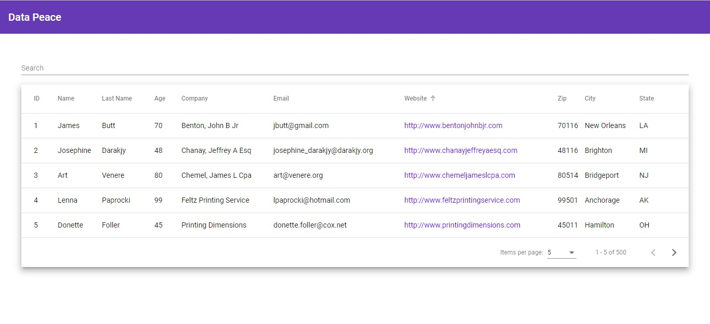
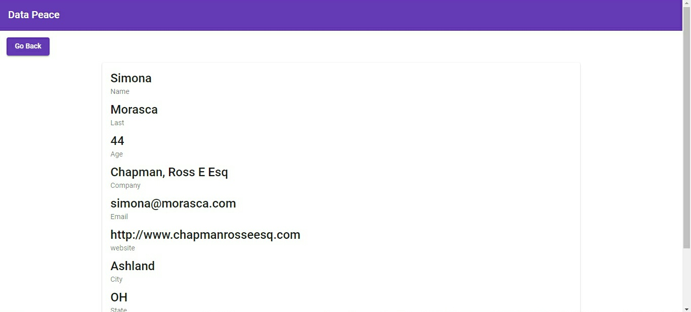

# Assignment

This project was generated with [Angular CLI](https://github.com/angular/angular-cli) version 7.3.7.

## Clone Directory
clone the directory thorugh `git clone`
 
## Install Dependencie
Install all the dependencies through `npm install`

## Development server
Run `ng serve` for a dev server. Navigate to `http://localhost:4200/`. The app will automatically reload if you change any of the source files.

## Running
After Running app will look like this

